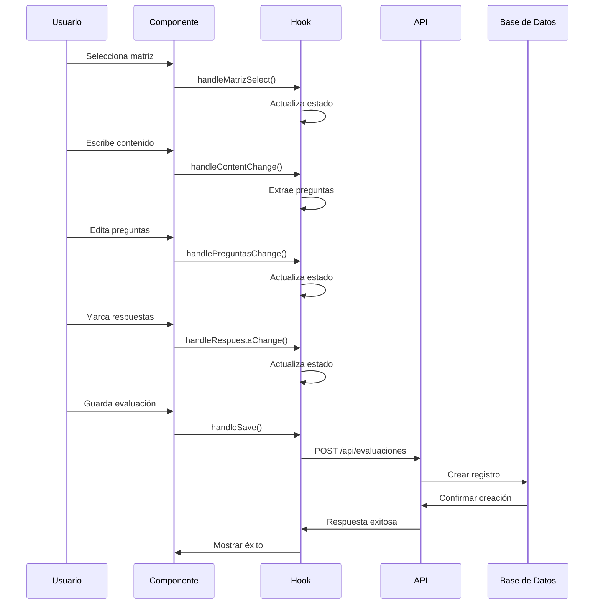
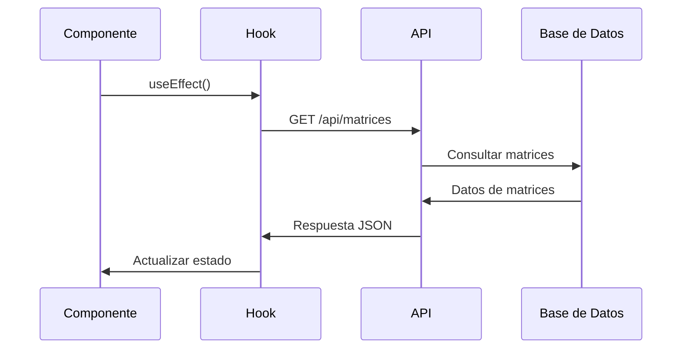
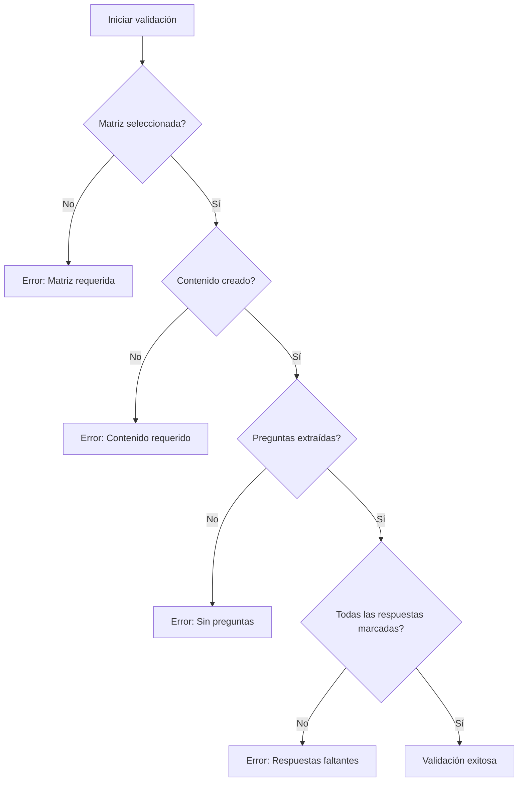

# 🏗️ Arquitectura del Sistema

Esta documentación describe la arquitectura general de la Plataforma Educativa, incluyendo patrones de diseño, estructura de código y decisiones técnicas.

## 📋 Índice

- [Arquitectura General](#arquitectura-general)
- [Patrones de Diseño](#patrones-de-diseño)
- [Estructura de Código](#estructura-de-código)
- [Flujo de Datos](#flujo-de-datos)
- [Tecnologías](#tecnologías)
- [Decisiones Técnicas](#decisiones-técnicas)
- [Escalabilidad](#escalabilidad)
- [Seguridad](#seguridad)

## 🏛️ Arquitectura General

### Diagrama de Alto Nivel
```
┌─────────────────┐    ┌─────────────────┐    ┌─────────────────┐
│   Frontend      │    │   Backend       │    │   Base de       │
│   (Next.js)     │◄──►│   (Next.js API) │◄──►│   Datos         │
│                 │    │                 │    │   (SQLite)      │
└─────────────────┘    └─────────────────┘    └─────────────────┘
         │                       │                       │
         │                       │                       │
         ▼                       ▼                       ▼
┌─────────────────┐    ┌─────────────────┐    ┌─────────────────┐
│   Componentes   │    │   Endpoints     │    │   Prisma        │
│   React         │    │   REST API      │    │   ORM           │
└─────────────────┘    └─────────────────┘    └─────────────────┘
```

### Principios Arquitectónicos

#### 1. Separación de Responsabilidades
- **Frontend:** Interfaz de usuario y lógica de presentación
- **Backend:** Lógica de negocio y APIs
- **Base de datos:** Persistencia de datos

#### 2. Componentes Reutilizables
- Hooks personalizados para lógica compartida
- Componentes UI modulares
- Utilidades y helpers centralizados

#### 3. Single Source of Truth
- Estado centralizado en hooks
- APIs como fuente única de datos
- Base de datos normalizada

## 🎨 Patrones de Diseño

### 1. Container/Presentational Pattern
```tsx
// Container Component
function EvaluacionContainer() {
  const { data, loading, error } = useEvaluacionForm()
  
  if (loading) return <LoadingSpinner />
  if (error) return <ErrorMessage error={error} />
  
  return <EvaluacionPresenter data={data} />
}

// Presentational Component
function EvaluacionPresenter({ data }) {
  return (
    <div>
      <h1>{data.titulo}</h1>
      <PreguntasList preguntas={data.preguntas} />
    </div>
  )
}
```

### 2. Custom Hooks Pattern
```tsx
// Lógica de negocio encapsulada
function useEvaluacionForm() {
  const [state, setState] = useState(initialState)
  
  const handleSave = useCallback(async () => {
    // Lógica de guardado
  }, [])
  
  return {
    ...state,
    handleSave
  }
}

// Componente limpio
function EvaluacionForm() {
  const { handleSave, loading } = useEvaluacionForm()
  
  return (
    <form onSubmit={handleSave}>
      {/* UI */}
    </form>
  )
}
```

### 3. Composition Pattern
```tsx
// Componente base
function BaseModal({ children, ...props }) {
  return (
    <Dialog {...props}>
      <div className="modal-content">
        {children}
      </div>
    </Dialog>
  )
}

// Composición específica
function SaveModal({ onSave, ...props }) {
  return (
    <BaseModal {...props}>
      <SaveForm onSave={onSave} />
    </BaseModal>
  )
}
```

### 4. Provider Pattern
```tsx
// Context para estado global
const EvaluacionContext = createContext()

function EvaluacionProvider({ children }) {
  const [state, setState] = useState(initialState)
  
  return (
    <EvaluacionContext.Provider value={{ state, setState }}>
      {children}
    </EvaluacionContext.Provider>
  )
}

// Hook para usar el contexto
function useEvaluacionContext() {
  const context = useContext(EvaluacionContext)
  if (!context) {
    throw new Error('useEvaluacionContext must be used within EvaluacionProvider')
  }
  return context
}
```

### 5. Reusable Components Pattern
```tsx
// Componente base reutilizable
function ResultadosHeader({ 
  title, 
  subtitle, 
  icon, 
  totalCount, 
  totalLabel,
  showBackButton,
  showExportButton 
}) {
  return (
    <div className="bg-gradient-to-r from-emerald-600 to-teal-600 rounded-xl p-6 text-white shadow-lg">
      <div className="flex items-center justify-between">
        <div className="flex items-center gap-4">
          <div className="bg-white/20 p-2 rounded-lg">
            {icon}
          </div>
          <div>
            <h1 className="text-2xl font-bold">{title}</h1>
            {subtitle && <p className="text-emerald-100 text-sm">{subtitle}</p>}
          </div>
        </div>
        <div className="bg-white/10 rounded-lg p-3">
          <div className="flex items-center gap-2">
            <div>
              <p className="text-emerald-200 text-xs">{totalLabel}</p>
              <p className="text-lg font-bold">{totalCount}</p>
            </div>
          </div>
        </div>
      </div>
    </div>
  )
}

// Uso consistente en toda la aplicación
function GraficosPage() {
  return (
    <div>
      <ResultadosHeader
        title="Gráficos de Resultados"
        subtitle="Análisis visual de rendimiento"
        icon={<BarChart3 className="h-6 w-6 text-white" />}
        totalCount={totalAlumnos}
        totalLabel="Total Estudiantes"
        showBackButton={true}
      />
      {/* Contenido de la página */}
    </div>
  )
}
```

## 📁 Estructura de Código

### Organización de Carpetas
```
src/
├── app/                          # Next.js App Router
│   ├── api/                      # Endpoints de API
│   │   ├── archivos/             # APIs de archivos
│   │   ├── evaluaciones/         # APIs de evaluaciones
│   │   ├── matrices/             # APIs de matrices
│   │   └── imagenes/             # APIs de imágenes
│   ├── editor/                   # Página del editor
│   ├── evaluaciones/             # Páginas de evaluaciones
│   ├── matrices/                 # Páginas de matrices
│   └── entrevista/               # Página de entrevista
├── components/                   # Componentes React
│   ├── editor/                   # Componentes del editor
│   ├── evaluacion/               # Componentes de evaluaciones
│   ├── entrevista/               # Componentes de entrevista
│   ├── matrices/                 # Componentes de matrices (refactorizados)
│   │   ├── MatrizBasicForm.tsx   # Formulario básico reutilizable
│   │   ├── MatrizOASelector.tsx  # Selector de OAs (Paso 2)
│   │   ├── MatrizIndicadoresSection.tsx # Gestión de indicadores (Paso 3)
│   │   ├── OASelector.tsx        # Componente base para selección de OAs
│   │   ├── IndicadoresSection.tsx # Componente base para indicadores
│   │   ├── MatrizStepIndicator.tsx # Indicador de pasos
│   │   ├── MatrizHeader.tsx      # Encabezado con estadísticas
│   │   └── ImportarMatrizModal.tsx # Modal de importación CSV
│   ├── resultados/               # Componentes reutilizables de resultados
│   │   ├── ResultadosHeader.tsx  # Header consistente para páginas
│   │   ├── LoadingState.tsx      # Estado de carga uniforme
│   │   ├── ErrorState.tsx        # Estado de error consistente
│   │   ├── SuccessState.tsx      # Estado de éxito uniforme
│   │   ├── ModalHeader.tsx       # Header para modales
│   │   └── index.ts              # Exportaciones centralizadas
│   ├── tiptap-ui/                # Componentes UI de TipTap
│   └── ui/                       # Componentes UI base
├── hooks/                        # Hooks personalizados
│   ├── use-evaluacion-form.ts    # Hook principal de evaluaciones
│   ├── use-preguntas-editor.ts   # Hook de edición de preguntas
│   ├── use-content-save.ts       # Hook de guardado
│   ├── useMatrices.ts            # Hook para gestión de matrices (refactorizado)
│   └── use-*.ts                  # Otros hooks
├── lib/                          # Utilidades y configuraciones
│   ├── prisma.ts                 # Cliente de Prisma
│   ├── extract-evaluacion.ts     # Extractor de preguntas
│   ├── resultados-utils.ts       # Utilidades para resultados y estadísticas
│   └── tiptap-utils.ts           # Utilidades de TipTap
├── types/                        # Tipos TypeScript centralizados
│   ├── matrices.ts               # Tipos para módulo de matrices
│   └── evaluacion.ts             # Tipos para evaluaciones
├── utils/                        # Utilidades compartidas
│   └── matrices.ts               # Funciones utilitarias para matrices
└── styles/                       # Estilos globales
    ├── _variables.scss           # Variables CSS
    └── _keyframe-animations.scss # Animaciones
```

### Convenciones de Nomenclatura

#### Archivos y Carpetas
- **PascalCase:** Componentes React (`MatrizSelector.tsx`)
- **camelCase:** Hooks y utilidades (`useEvaluacionForm.ts`)
- **kebab-case:** Carpetas y rutas (`evaluaciones/crear/`)

#### Variables y Funciones
- **camelCase:** Variables y funciones (`handleSave`, `isLoading`)
- **PascalCase:** Componentes y tipos (`EvaluacionForm`, `MatrizType`)
- **UPPER_SNAKE_CASE:** Constantes (`API_ENDPOINTS`)

#### APIs
- **RESTful:** `/api/evaluaciones`, `/api/evaluaciones/[id]`
- **HTTP Methods:** GET, POST, PUT, DELETE
- **Status Codes:** 200, 201, 400, 404, 500

## 🔄 Flujo de Datos

### 1. Flujo de Creación de Evaluación


### 2. Flujo de Carga de Datos


### 3. Flujo de Validación


## 🛠️ Tecnologías

### Frontend
- **Next.js 14:** Framework React con App Router
- **React 18:** Biblioteca de UI con hooks
- **TypeScript:** Tipado estático
- **Tailwind CSS:** Framework de estilos
- **TipTap:** Editor de texto enriquecido
- **Headless UI:** Componentes accesibles

### Backend
- **Next.js API Routes:** Endpoints REST
- **Prisma:** ORM para base de datos
- **SQLite:** Base de datos local
- **Zod:** Validación de esquemas

### Herramientas de Desarrollo
- **ESLint:** Linting de código
- **Prettier:** Formateo de código
- **TypeScript:** Compilador y checker
- **Prisma Studio:** Interfaz de base de datos

### Librerías de Terceros
- **Lucide React:** Iconos
- **React Hook Form:** Manejo de formularios
- **React Query:** Gestión de estado del servidor
- **Framer Motion:** Animaciones

## 🎯 Decisiones Técnicas

### 1. Next.js App Router
**Decisión:** Usar App Router en lugar de Pages Router
**Razones:**
- Mejor rendimiento con Server Components
- Layouts anidados más flexibles
- Mejor SEO con Server-Side Rendering
- Futuro de Next.js

### 2. SQLite sobre PostgreSQL
**Decisión:** SQLite para desarrollo y producción inicial
**Razones:**
- Simplicidad de configuración
- No requiere servidor de base de datos
- Suficiente para carga inicial
- Fácil backup y portabilidad

### 3. TipTap sobre Draft.js
**Decisión:** TipTap como editor de texto
**Razones:**
- Mejor integración con React
- API más moderna y flexible
- Mejor rendimiento
- Comunidad activa

### 4. Custom Hooks sobre Context
**Decisión:** Hooks personalizados para lógica de estado
**Razones:**
- Mejor testabilidad
- Reutilización más fácil
- Menos prop drilling
- Mejor separación de responsabilidades

### 5. Tailwind CSS sobre CSS Modules
**Decisión:** Tailwind CSS para estilos
**Razones:**
- Desarrollo más rápido
- Consistencia en diseño
- Menor bundle size
- Mejor mantenibilidad

## 📈 Escalabilidad

### Estrategias de Escalabilidad

#### 1. Escalabilidad Horizontal
- **Microservicios:** Separar módulos en servicios independientes
- **Load Balancing:** Distribuir carga entre múltiples instancias
- **CDN:** Servir assets estáticos desde CDN

#### 2. Escalabilidad Vertical
- **Optimización de consultas:** Índices y consultas eficientes
- **Caching:** Redis para caché de datos frecuentes
- **Compresión:** Gzip/Brotli para assets

#### 3. Escalabilidad de Código
- **Modularización:** Componentes y hooks reutilizables
- **Lazy Loading:** Carga bajo demanda de componentes
- **Code Splitting:** Separar código por rutas

### Plan de Migración

#### Fase 1: Optimización Actual
- [ ] Implementar caching con React Query
- [ ] Optimizar consultas de base de datos
- [ ] Implementar lazy loading de componentes

#### Fase 2: Arquitectura Distribuida
- [ ] Migrar a PostgreSQL
- [ ] Implementar Redis para caché
- [ ] Separar APIs en microservicios

#### Fase 3: Escalabilidad Avanzada
- [ ] Implementar CDN
- [ ] Configurar load balancer
- [ ] Monitoreo y alertas

## 🔒 Seguridad

### Medidas de Seguridad Implementadas

#### 1. Validación de Entrada
```typescript
// Validación con Zod
const EvaluacionSchema = z.object({
  titulo: z.string().min(1).max(200),
  matrizId: z.number().positive(),
  preguntas: z.array(PreguntaSchema)
})
```

#### 2. Sanitización de Datos
```typescript
// Sanitización de contenido HTML
import DOMPurify from 'dompurify'

const sanitizedContent = DOMPurify.sanitize(content)
```

#### 3. Rate Limiting
```typescript
// Rate limiting en APIs
import rateLimit from 'express-rate-limit'

const limiter = rateLimit({
  windowMs: 15 * 60 * 1000, // 15 minutos
  max: 100 // máximo 100 requests por ventana
})
```

#### 4. CORS Configuration
```typescript
// Configuración de CORS
const corsOptions = {
  origin: process.env.ALLOWED_ORIGINS?.split(',') || ['http://localhost:3000'],
  credentials: true
}
```

### Próximas Mejoras de Seguridad

#### Autenticación y Autorización
- [ ] Implementar JWT tokens
- [ ] Sistema de roles y permisos
- [ ] OAuth con Google/Microsoft

#### Protección de Datos
- [ ] Encriptación de datos sensibles
- [ ] Backup automático
- [ ] Logs de auditoría

#### Seguridad de APIs
- [ ] API keys para servicios externos
- [ ] Validación de esquemas más estricta
- [ ] Rate limiting por usuario

## 🧪 Testing

### Estrategia de Testing

#### 1. Testing de Componentes
```typescript
// Test de componente con React Testing Library
import { render, screen, fireEvent } from '@testing-library/react'

test('MatrizSelector should show selected matrix', () => {
  render(<MatrizSelector matrices={mockMatrices} selectedMatriz={mockMatrices[0]} />)
  
  expect(screen.getByText(mockMatrices[0].nombre)).toBeInTheDocument()
})
```

#### 2. Testing de Hooks
```typescript
// Test de hook con renderHook
import { renderHook, act } from '@testing-library/react'

test('useEvaluacionForm should validate form', () => {
  const { result } = renderHook(() => useEvaluacionForm())
  
  act(() => {
    result.current.validateForm()
  })
  
  expect(result.current.errors).toBeDefined()
})
```

#### 3. Testing de APIs
```typescript
// Test de API con supertest
import request from 'supertest'

test('GET /api/evaluaciones should return evaluations', async () => {
  const response = await request(app).get('/api/evaluaciones')
  
  expect(response.status).toBe(200)
  expect(Array.isArray(response.body)).toBe(true)
})
```

### Cobertura de Testing

#### Objetivos de Cobertura
- **Componentes:** 80% de cobertura
- **Hooks:** 90% de cobertura
- **APIs:** 85% de cobertura
- **Utilidades:** 95% de cobertura

#### Herramientas de Testing
- **Jest:** Framework de testing
- **React Testing Library:** Testing de componentes
- **MSW:** Mocking de APIs
- **Cypress:** Testing E2E

## 📊 Monitoreo y Logging

### Métricas a Monitorear

#### Performance
- **Time to First Byte (TTFB)**
- **First Contentful Paint (FCP)**
- **Largest Contentful Paint (LCP)**
- **Cumulative Layout Shift (CLS)**

#### Errores
- **Error rate por endpoint**
- **Error rate por componente**
- **Tiempo de respuesta promedio**
- **Errores de base de datos**

#### Negocio
- **Usuarios activos**
- **Evaluaciones creadas**
- **Tiempo de sesión**
- **Tasa de conversión**

### Herramientas de Monitoreo

#### Frontend
- **Vercel Analytics:** Métricas de rendimiento
- **Sentry:** Error tracking
- **Google Analytics:** Métricas de usuario

#### Backend
- **Prisma Studio:** Monitoreo de base de datos
- **Console logs:** Logs estructurados
- **Health checks:** Endpoints de salud

## 🚀 Deployment

### Estrategia de Deployment

#### Desarrollo
- **Local:** `npm run dev`
- **Preview:** Vercel preview deployments
- **Staging:** Vercel staging environment

#### Producción
- **Vercel:** Platform as a Service
- **GitHub Actions:** CI/CD pipeline
- **Environment variables:** Configuración segura

### Pipeline de CI/CD

```yaml
# .github/workflows/deploy.yml
name: Deploy to Production

on:
  push:
    branches: [main]

jobs:
  deploy:
    runs-on: ubuntu-latest
    steps:
      - uses: actions/checkout@v3
      - uses: actions/setup-node@v3
      - run: npm ci
      - run: npm run build
      - run: npm run test
      - uses: amondnet/vercel-action@v20
```

---

**Última actualización:** Julio 2025  
**Versión de arquitectura:** 1.0  
**Mantenido por:** Equipo de Desarrollo 