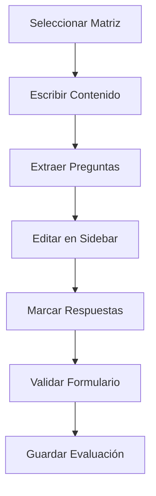
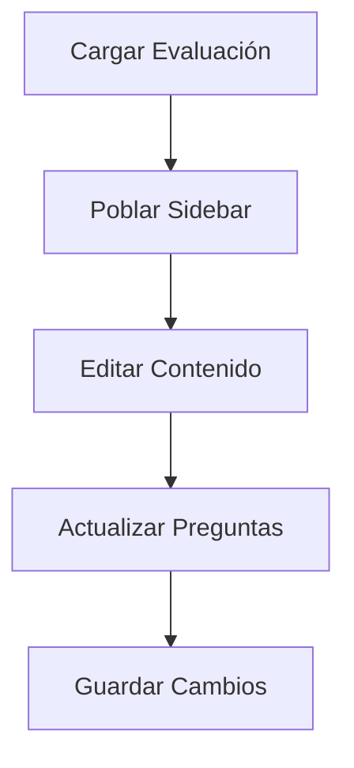

# 🎯 Módulo de Evaluaciones

El módulo de evaluaciones permite crear, editar y gestionar evaluaciones basadas en matrices de especificación, con un editor avanzado y gestión de preguntas y alternativas.

## 📋 Índice

- [Características Principales](#características-principales)
- [Arquitectura del Sistema](#arquitectura-del-sistema)
- [Flujo de Trabajo](#flujo-de-trabajo)
- [Componentes](#componentes)
- [Hooks Personalizados](#hooks-personalizados)
- [APIs](#apis)
- [Base de Datos](#base-de-datos)
- [Casos de Uso](#casos-de-uso)
- [Troubleshooting](#troubleshooting)

## 🚨 Lecciones Aprendidas - Evaluaciones

### ⚠️ **PROBLEMAS CRÍTICOS RESUELTOS**

#### 1. **Error: `evaluaciones.map is not a function`**

**Problema:** El frontend fallaba al intentar hacer `.map()` sobre datos que no eran arrays.

**Causa Raíz:**

- APIs devolviendo objetos `{ data: [...] }` en lugar de arrays directos
- Cambios en nombres de relaciones Prisma sin actualizar APIs
- Falta de validación en el frontend

**Solución Implementada:**

```typescript
// En el frontend (src/app/evaluaciones/page.tsx)
useEffect(() => {
  fetch('/api/evaluaciones')
    .then(res => res.json())
    .then(data => {
      console.log('Datos recibidos de la API:', data);
      // Asegurar que data sea siempre un array
      const evaluacionesArray = Array.isArray(data) ? data : [];
      setEvaluaciones(evaluacionesArray);
      setLoading(false);
    })
    .catch((error) => {
      console.error('Error al cargar evaluaciones:', error);
      setAlert({ type: 'error', message: 'Error al cargar las evaluaciones' });
      setLoading(false);
    });
}, []);

// En el render
{Array.isArray(evaluaciones) && evaluaciones.map((ev) => (
  <tr key={ev.id}>
    {/* contenido */}
  </tr>
))}
```

#### 2. **Inconsistencia en Nombres de Relaciones Prisma**

**Problema:** Las APIs usaban nombres de relaciones que no coincidían con el schema.

**Causa Raíz:**

- Cliente Prisma generado con nombres diferentes al schema
- Cambios en relaciones sin regenerar cliente
- Falta de sincronización entre schema y código

**Solución Implementada:**

```typescript
// API corregida (src/app/api/evaluaciones/route.ts)
const evaluaciones = await prisma.evaluacion.findMany({
  include: {
    archivo: true, // ✅ Nombres del schema
    matriz: true, // ✅ Nombres del schema
    preguntas: true, // ✅ Nombres del schema
  },
});

// Mapeo correcto
const data = evaluaciones.map(ev => ({
  id: ev.id,
  titulo: ev.archivo?.titulo || '',
  matrizId: ev.matrizId,
  matrizNombre: ev.matriz?.nombre || '',
  preguntasCount: ev.preguntas?.length || 0,
  createdAt: ev.createdAt,
}));
```

#### 3. **Estructura de Respuestas API Inconsistente**

**Problema:** Algunas APIs devolvían objetos, otras arrays.

**Solución Implementada:**

```typescript
// GET endpoints SIEMPRE devuelven arrays
export async function GET() {
  try {
    // ... lógica de obtención
    return NextResponse.json(data); // ✅ Array directo
  } catch (error) {
    console.error('Error al obtener evaluaciones:', error);
    return NextResponse.json([]); // ✅ Array vacío en caso de error
  }
}
```

### 🔧 **LINEAMIENTOS ESPECÍFICOS PARA EVALUACIONES**

#### 1. **Validación Frontend Obligatoria**

```typescript
// SIEMPRE validar antes de usar .map()
const evaluacionesArray = Array.isArray(data) ? data : []

// SIEMPRE validar en el render
{Array.isArray(evaluaciones) && evaluaciones.map((ev) => (
  // contenido
))}
```

#### 2. **Nombres de Relaciones Prisma**

```typescript
// ✅ CORRECTO - Usar nombres del schema
include: {
  archivo: true,
  matriz: true,
  preguntas: true,
  alternativas: true
}

// ❌ INCORRECTO - No cambiar nombres arbitrariamente
include: {
  Archivo: true,
  MatrizEspecificacion: true,
  Pregunta: true,
  Alternativa: true
}
```

#### 3. **Regeneración de Cliente Prisma**

```bash
# Después de cambios en schema.prisma
npx prisma generate

# Verificar que los tipos coincidan
npx prisma studio
```

#### 4. **Testing de APIs**

```bash
# Probar endpoint inmediatamente
curl http://localhost:3000/api/evaluaciones

# Verificar formato de respuesta
curl http://localhost:3000/api/evaluaciones | jq .
```

### 📋 **CHECKLIST PARA CAMBIOS EN EVALUACIONES**

#### Antes de Modificar

- [ ] Verificar estado actual: `git status`
- [ ] Probar API actual: `curl /api/evaluaciones`
- [ ] Verificar frontend funciona
- [ ] Crear backup si es necesario

#### Durante Modificaciones

- [ ] Cambios incrementales
- [ ] Testing después de cada cambio
- [ ] Verificar nombres de relaciones Prisma
- [ ] Logs para debugging

#### Después de Modificaciones

- [ ] Regenerar Prisma: `npx prisma generate`
- [ ] Reiniciar servidor: `npm run dev`
- [ ] Probar API: `curl /api/evaluaciones`
- [ ] Verificar frontend: navegar a `/evaluaciones`
- [ ] Probar todas las funcionalidades

### 🚫 **ERRORES COMUNES A EVITAR**

#### 1. **Cambiar Nombres de Relaciones Sin Verificar**

```typescript
// ❌ NO HACER
const evaluaciones = await prisma.evaluacion.findMany({
  include: {
    Archivo: true, // Cambió sin verificar
    MatrizEspecificacion: true, // Cambió sin verificar
  },
});
```

#### 2. **Frontend Sin Validación**

```typescript
// ❌ NO HACER
const data = await res.json();
setEvaluaciones(data); // Sin validar si es array
```

#### 3. **APIs Devuelven Objetos**

```typescript
// ❌ NO HACER
return NextResponse.json({ data: evaluaciones });
```

### 🔍 **DEBUGGING ESPECÍFICO**

#### Logs Útiles

```typescript
// En el frontend
console.log('Datos recibidos de la API:', data);
console.log('Tipo de datos:', typeof data);
console.log('Es array:', Array.isArray(data));

// En la API
console.error('Error al obtener evaluaciones:', error);
```

#### Verificación de Schema

```bash
# Verificar schema actual
cat prisma/schema.prisma | grep -A 10 "model Evaluacion"

# Verificar cliente generado
npx prisma generate
```

#### Testing de Endpoints

```bash
# Probar GET
curl http://localhost:3000/api/evaluaciones

# Probar POST
curl -X POST http://localhost:3000/api/evaluaciones \
  -H "Content-Type: application/json" \
  -d '{"archivoId": 1, "matrizId": 1, "preguntas": []}'
```

## ✨ Características Principales

### 🎨 Editor Avanzado

- **Editor TipTap** con funcionalidades completas de texto enriquecido
- **Extracción automática** de preguntas y alternativas del contenido
- **Edición en tiempo real** con sincronización automática
- **Soporte para imágenes** y contenido multimedia

### 📝 Gestión de Preguntas

- **Edición inline** de preguntas y alternativas
- **Reordenamiento** de preguntas con botones de subir/bajar
- **Eliminación** de preguntas y alternativas individuales
- **Marcado de respuestas correctas** con radio buttons

### 🔄 Modos de Trabajo

- **Modo Creación:** Crear nuevas evaluaciones con título
- **Modo Edición:** Editar evaluaciones existentes sin duplicar
- **Carga desde FAB:** Cargar evaluaciones guardadas filtradas por matriz

### ✅ Validaciones

- **Matriz requerida** antes de guardar
- **Preguntas mínimas** (al menos 1 pregunta)
- **Respuestas correctas** marcadas para todas las preguntas
- **Título requerido** solo en modo creación

## 🏗️ Arquitectura del Sistema

### Estructura de Archivos

```
src/
├── app/evaluaciones/
│   └── crear/
│       └── page.tsx              # Página principal de evaluaciones
├── components/evaluacion/
│   ├── MatrizSelector.tsx        # Selector de matriz
│   ├── PreguntasSidebar.tsx      # Sidebar de preguntas
│   └── SaveModal.tsx             # Modal de guardado
├── hooks/
│   ├── use-evaluacion-form.ts    # Hook principal del formulario
│   └── use-preguntas-editor.ts   # Hook de edición de preguntas
└── lib/
    └── extract-evaluacion.ts     # Extractor de preguntas
```

### Flujo de Datos

```
Editor TipTap → Extractor → Sidebar → Validación → API → Base de Datos
     ↓              ↓           ↓          ↓        ↓         ↓
  Contenido    Preguntas    Edición    Errores   Guardado   Persistencia
```

## 🔄 Flujo de Trabajo

### 1. Creación de Evaluación



### 2. Edición de Evaluación



### 3. Validaciones

- ✅ Matriz seleccionada
- ✅ Contenido creado
- ✅ Preguntas extraídas
- ✅ Todas las respuestas marcadas
- ✅ Título (solo en creación)

## 🧩 Componentes

### MatrizSelector

**Ubicación:** `src/components/evaluacion/MatrizSelector.tsx`

Selector dropdown para elegir la matriz de especificación.

```tsx
interface MatrizSelectorProps {
  matrices: MatrizEspecificacion[];
  selectedMatriz: MatrizEspecificacion | null;
  onMatrizSelect: (matriz: MatrizEspecificacion) => void;
  error?: string;
}
```

**Características:**

- Dropdown con Headless UI
- Muestra información de preguntas y OAs
- Validación de errores
- Diseño responsive

### PreguntasSidebar

**Ubicación:** `src/components/evaluacion/PreguntasSidebar.tsx`

Sidebar para gestionar preguntas y alternativas.

```tsx
interface PreguntasSidebarProps {
  preguntasExtraidas: PreguntaExtraida[];
  respuestasCorrectas: { [preguntaNumero: number]: string };
  onRespuestaChange: (preguntaNumero: number, letra: string) => void;
  onPreguntasChange: (preguntas: PreguntaExtraida[]) => void;
  onFormDataChange: (data: any) => void;
  formData: any;
  error?: string;
}
```

**Funcionalidades:**

- Edición inline de preguntas y alternativas
- Reordenamiento con botones de flecha
- Eliminación con dropdown de acciones
- Marcado de respuestas correctas
- Estados de edición y validación

### SaveModal

**Ubicación:** `src/components/evaluacion/SaveModal.tsx`

Modal para guardar evaluaciones (solo en modo creación).

```tsx
interface SaveModalProps {
  isOpen: boolean;
  onClose: () => void;
  onSave: () => void;
  titulo: string;
  onTituloChange: (titulo: string) => void;
  saving: boolean;
  error?: string;
}
```

**Características:**

- Input para título de evaluación
- Estados de carga y error
- Validación de título requerido
- Diseño consistente con el sistema

## 🎣 Hooks Personalizados

### useEvaluacionForm

**Ubicación:** `src/hooks/use-evaluacion-form.ts`

Hook principal que maneja toda la lógica del formulario de evaluación.

```tsx
const {
  // Estado
  loading,
  saving,
  matrices,
  selectedMatriz,
  preguntasExtraidas,
  formData,
  showSaveModal,
  titulo,
  errors,
  showSuccess,
  evaluacionId,

  // Handlers
  handleEditorReady,
  handleMatrizSelect,
  handleRespuestaCorrectaChange,
  handleSave,
  handleLoadContent,
  clearErrors,
  updateFormData,

  // Utilidades
  validateForm,
} = useEvaluacionForm();
```

**Funcionalidades:**

- Gestión de estado del formulario
- Carga de matrices desde API
- Sincronización con editor TipTap
- Validaciones automáticas
- Guardado en modo creación/edición
- Carga de evaluaciones existentes

### usePreguntasEditor

**Ubicación:** `src/hooks/use-preguntas-editor.ts`

Hook para manejar la edición de preguntas y alternativas.

```tsx
const {
  editingPregunta,
  editValue,
  openDropdown,
  handleStartEdit,
  handleSaveEdit,
  handleCancelEdit,
  handleKeyPress,
  handleDeletePregunta,
  handleDeleteAlternativa,
  handleToggleDropdown,
  handleDropdownAction,
} = usePreguntasEditor();
```

**Funcionalidades:**

- Estados de edición inline
- Gestión de dropdowns de acciones
- Eliminación de preguntas/alternativas
- Reordenamiento automático
- Validaciones de teclado (Enter/Escape)

## 🔌 APIs

### GET /api/evaluaciones

Obtiene todas las evaluaciones con sus relaciones.

**Respuesta:**

```json
[
  {
    "id": 1,
    "archivoId": 1,
    "matrizId": 1,
    "archivo": {
      "id": 1,
      "titulo": "Evaluación de Matemáticas",
      "contenido": "..."
    },
    "matriz": {
      "id": 1,
      "nombre": "Matriz de Matemáticas"
    },
    "preguntas": [
      {
        "id": 1,
        "numero": 1,
        "texto": "¿Cuánto es 2+2?",
        "alternativas": [
          {
            "id": 1,
            "letra": "A",
            "texto": "3",
            "esCorrecta": false
          },
          {
            "id": 2,
            "letra": "B",
            "texto": "4",
            "esCorrecta": true
          }
        ]
      }
    ]
  }
]
```

### POST /api/evaluaciones

Crea una nueva evaluación.

**Body:**

```json
{
  "archivoId": 1,
  "matrizId": 1,
  "contenido": "JSON del contenido TipTap",
  "preguntas": [
    {
      "numero": 1,
      "texto": "¿Cuánto es 2+2?",
      "alternativas": [
        { "letra": "A", "texto": "3" },
        { "letra": "B", "texto": "4" }
      ]
    }
  ],
  "respuestasCorrectas": {
    "1": "B"
  }
}
```

### PUT /api/evaluaciones/[id]

Actualiza una evaluación existente.

**Body:**

```json
{
  "contenido": "JSON del contenido TipTap",
  "preguntas": [...],
  "respuestasCorrectas": {...}
}
```

### GET /api/evaluaciones/[id]

Obtiene una evaluación específica.

### DELETE /api/evaluaciones/[id]

Elimina una evaluación y sus relaciones.

## 🗄️ Base de Datos

### Tabla `evaluacion`

```sql
CREATE TABLE evaluacion (
  id INTEGER PRIMARY KEY AUTOINCREMENT,
  archivoId INTEGER NOT NULL,
  matrizId INTEGER NOT NULL,
  FOREIGN KEY (archivoId) REFERENCES archivo(id),
  FOREIGN KEY (matrizId) REFERENCES matriz_especificacion(id)
);
```

### Tabla `pregunta`

```sql
CREATE TABLE pregunta (
  id INTEGER PRIMARY KEY AUTOINCREMENT,
  evaluacionId INTEGER NOT NULL,
  numero INTEGER NOT NULL,
  texto TEXT NOT NULL,
  FOREIGN KEY (evaluacionId) REFERENCES evaluacion(id)
);
```

### Tabla `alternativa`

```sql
CREATE TABLE alternativa (
  id INTEGER PRIMARY KEY AUTOINCREMENT,
  preguntaId INTEGER NOT NULL,
  letra TEXT NOT NULL,
  texto TEXT NOT NULL,
  esCorrecta BOOLEAN DEFAULT false,
  FOREIGN KEY (preguntaId) REFERENCES pregunta(id)
);
```

### Relaciones

- `evaluacion` → `archivo` (1:1)
- `evaluacion` → `matriz_especificacion` (N:1)
- `evaluacion` → `pregunta` (1:N)
- `pregunta` → `alternativa` (1:N)

## 🎯 Casos de Uso

### Caso 1: Crear Evaluación desde Cero

1. **Navegar** a `/evaluaciones/crear`
2. **Seleccionar** matriz de especificación
3. **Escribir** contenido en el editor TipTap
4. **Revisar** preguntas extraídas automáticamente
5. **Editar** preguntas y alternativas si es necesario
6. **Marcar** respuestas correctas
7. **Guardar** con título

### Caso 2: Editar Evaluación Existente

1. **Cargar** evaluación desde FAB
2. **Modificar** contenido en el editor
3. **Ajustar** preguntas y alternativas
4. **Actualizar** respuestas correctas
5. **Guardar** cambios (sin título)

### Caso 3: Reordenar Preguntas

1. **Usar** botones de flecha en cada pregunta
2. **Verificar** que las respuestas se mantengan
3. **Guardar** para persistir cambios

### Caso 4: Eliminar Pregunta

1. **Abrir** dropdown de acciones
2. **Seleccionar** "Eliminar"
3. **Confirmar** eliminación
4. **Verificar** reordenamiento automático

## 🔧 Troubleshooting

### Problemas Comunes

#### Error: "No se detectaron preguntas"

**Causa:** El extractor no puede identificar preguntas en el contenido.
**Solución:**

- Verificar formato del contenido (números seguidos de punto)
- Asegurar que las alternativas tengan letras (A, B, C, D)
- Revisar estructura del documento TipTap

#### Error: "Faltan respuestas correctas"

**Causa:** No se han marcado todas las respuestas correctas.
**Solución:**

- Revisar cada pregunta en el sidebar
- Marcar una alternativa por pregunta
- Verificar que no haya preguntas sin respuesta

#### Error: "Debe seleccionar una matriz"

**Causa:** No se ha elegido una matriz de especificación.
**Solución:**

- Seleccionar matriz del dropdown
- Verificar que las matrices se cargan correctamente
- Revisar conexión con API

#### Problema: Cambios no se guardan

**Causa:** Modo edición vs creación confundido.
**Solución:**

- Verificar si es evaluación nueva o existente
- En edición, no se pide título
- Revisar logs del navegador para errores

#### Problema: FAB no aparece

**Causa:** No hay matriz seleccionada.
**Solución:**

- Seleccionar matriz primero
- Verificar que la matriz tiene evaluaciones
- Revisar filtros del FAB

### Debug y Logs

#### Verificar Estado del Formulario

```javascript
// En consola del navegador
console.log('Estado actual:', {
  selectedMatriz,
  preguntasExtraidas,
  respuestasCorrectas,
  evaluacionId,
});
```

#### Verificar API Calls

```bash
# Verificar matrices
curl http://localhost:3000/api/matrices

# Verificar evaluaciones
curl http://localhost:3000/api/evaluaciones
```

#### Verificar Base de Datos

```bash
# Abrir Prisma Studio
npx prisma studio

# Verificar tablas
npx prisma db pull
```

### Performance

#### Optimizaciones Implementadas

- **Debounce** en extracción de preguntas
- **Memoización** de componentes pesados
- **Lazy loading** de evaluaciones en FAB
- **Optimistic updates** en edición

#### Monitoreo

- **React DevTools** para profiling
- **Network tab** para API calls
- **Console** para errores y warnings

## 🚀 Próximas Mejoras

### Funcionalidades Planificadas

- [ ] **Importar/Exportar** evaluaciones en formato PDF
- [ ] **Plantillas** de evaluaciones predefinidas
- [ ] **Estadísticas** de rendimiento por pregunta
- [ ] **Colaboración** en tiempo real
- [ ] **Versionado** de evaluaciones

### Mejoras Técnicas

- [ ] **Caché** de evaluaciones frecuentes
- [ ] **Offline mode** para edición
- [ ] **Auto-save** cada 30 segundos
- [ ] **Undo/Redo** para cambios
- [ ] **Búsqueda** en contenido de evaluaciones

---

**Última actualización:** Julio 2025  
**Versión del módulo:** 2.0 (Refactorizado)  
**Mantenido por:** Equipo de Desarrollo
