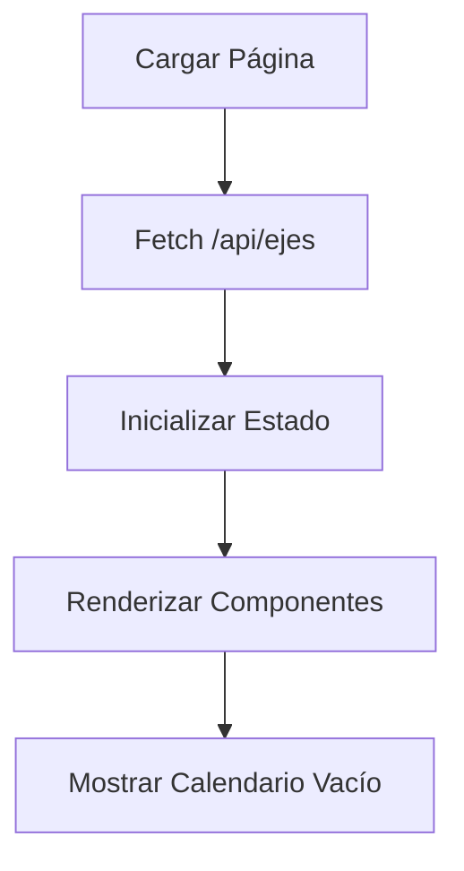
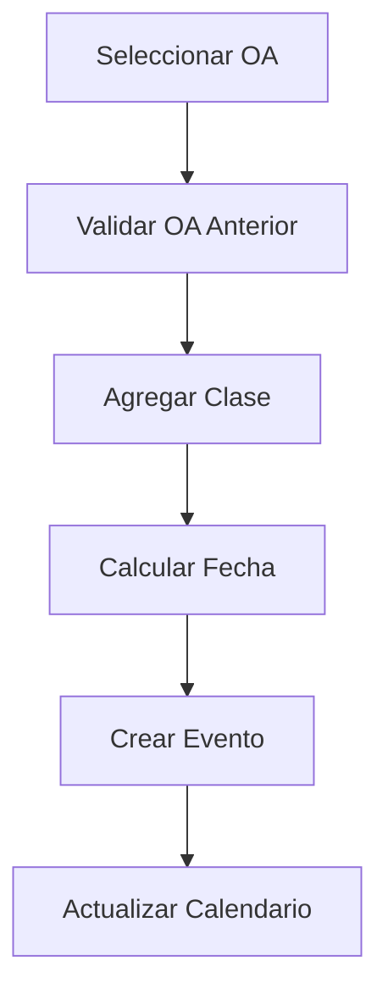

# 📅 Planificación Anual

## Descripción General

El módulo de Planificación Anual permite a los docentes gestionar la distribución temporal de Objetivos de Aprendizaje (OAs) a lo largo del año académico, utilizando un calendario interactivo y un sistema de asignación visual por ejes temáticos.

## ✨ Características Principales

### 🗓️ Calendario Interactivo
- **Calendario Origin UI** con diseño moderno y responsivo
- **Eventos con colores por eje** para identificación visual rápida
- **Horarios fijos** (Martes y Jueves, 9-10 y 12-13)
- **Distribución automática** de módulos desde julio 2025

### 🎯 Gestión de OAs
- **Agrupación por ejes** temáticos
- **Secuencia obligatoria** de OAs dentro de cada eje
- **Validación de mínimo de clases** antes del siguiente OA
- **Filtros avanzados** por eje y OAs asignables
- **Contadores visuales** de clases asignadas

### 🎨 Interfaz de Usuario
- **Drawer lateral** para gestión de OAs
- **Componentes modulares** y reutilizables
- **Tipado fuerte** con TypeScript
- **Responsive design** para diferentes dispositivos

## 🏗️ Arquitectura del Sistema

### Estructura de Archivos
```
src/
├── app/planificacion-anual/
│   └── page.tsx                    # Página principal
├── components/planificacion-anual/
│   ├── FiltrosDrawer.tsx          # Componente de filtros
│   ├── OACard.tsx                 # Tarjeta individual de OA
│   ├── EjeSection.tsx             # Sección completa de eje
│   ├── OADrawerContent.tsx        # Contenido del drawer
│   ├── types.ts                   # Tipos compartidos
│   └── index.ts                   # Exportaciones
├── hooks/
│   └── use-planificacion-anual.ts # Hook principal
└── styles/
    └── calendar.css               # Estilos del calendario
```

### Flujo de Datos
```
API /api/ejes → Hook → Componentes → Calendario
     ↓              ↓           ↓          ↓
  Datos OAs    Estado UI    Interacción   Eventos
```

## 🔄 Flujo de Trabajo

### 1. Carga de Datos


### 2. Asignación de Clases


### 3. Validaciones
- ✅ OA anterior debe cumplir mínimo de clases
- ✅ Secuencia respetada dentro del eje
- ✅ Fechas calculadas correctamente
- ✅ Colores asignados por eje

## 🧩 Componentes

### FiltrosDrawer
**Ubicación:** `src/components/planificacion-anual/FiltrosDrawer.tsx`

Componente para filtrar OAs por eje y mostrar solo asignables.

```tsx
interface FiltrosDrawerProps {
  selectedEjeId: string;
  setSelectedEjeId: (value: string) => void;
  showOnlyAssignable: boolean;
  setShowOnlyAssignable: (value: boolean) => void;
  ejeOptions: { value: string; label: string }[];
}
```

**Características:**
- Dropdown para filtrar por eje
- Switch para mostrar solo OAs asignables
- Diseño consistente con el resto de la app

### OACard
**Ubicación:** `src/components/planificacion-anual/OACard.tsx`

Tarjeta individual de un OA con controles de asignación.

```tsx
interface OACardProps {
  oa: OA;
  oaClases: OAClases;
  onAddClase: (oa: OA, prevOA: OA | null) => void;
  onRemoveClase: (oa: OA, nextOA: OA | null) => void;
  prevOA: OA | null;
  nextOA: OA | null;
}
```

**Características:**
- Botones + y - para asignar/remover clases
- Validación visual de estado
- Contador de clases asignadas
- Indicador de OA basal

### EjeSection
**Ubicación:** `src/components/planificacion-anual/EjeSection.tsx`

Sección completa de un eje con todos sus OAs.

```tsx
interface EjeSectionProps {
  eje: Eje;
  ejeIdx: number;
  oaClases: OAClases;
  onAddClase: (oa: OA, prevOA: OA | null) => void;
  onRemoveClase: (oa: OA, nextOA: OA | null) => void;
}
```

**Características:**
- Header con ícono y título del eje
- Lista de OAs del eje
- Manejo de secuencia entre OAs

### OADrawerContent
**Ubicación:** `src/components/planificacion-anual/OADrawerContent.tsx`

Contenido completo del drawer de OAs.

```tsx
interface OADrawerContentProps {
  loadingOAs: boolean;
  ejesFiltrados: Eje[];
  selectedEjeId: string;
  setSelectedEjeId: (value: string) => void;
  showOnlyAssignable: boolean;
  setShowOnlyAssignable: (value: boolean) => void;
  ejeOptions: { value: string; label: string }[];
  oaClases: OAClases;
  onAddClase: (oa: OA, prevOA: OA | null) => void;
  onRemoveClase: (oa: OA, nextOA: OA | null) => void;
}
```

**Características:**
- Integra filtros y secciones de ejes
- Manejo de estados de carga
- Layout responsive

## 🎣 Hooks Personalizados

### usePlanificacionAnual
**Ubicación:** `src/hooks/use-planificacion-anual.ts`

Hook principal que maneja toda la lógica de la planificación anual.

```tsx
export function usePlanificacionAnual() {
  // Estados
  const [events, setEvents] = useState<CalendarEvent[]>([]);
  const [ejes, setEjes] = useState<Eje[]>([]);
  const [oaClases, setOaClases] = useState<OAClases>({});
  const [loadingOAs, setLoadingOAs] = useState(false);
  const [showOnlyAssignable, setShowOnlyAssignable] = useState(false);
  const [selectedEjeId, setSelectedEjeId] = useState<string>("Todos");

  // Funciones
  const handleAddClase = (oa: OA, prevOA: OA | null) => { /* ... */ };
  const handleRemoveClase = (oa: OA, nextOA: OA | null) => { /* ... */ };
  const handleEventAdd = (event: CalendarEvent) => { /* ... */ };
  const handleEventUpdate = (updatedEvent: CalendarEvent) => { /* ... */ };
  const handleEventDelete = (eventId: string) => { /* ... */ };

  // Cálculos
  const ejeOptions = [/* ... */];
  const ejesFiltrados = [/* ... */];

  return {
    events, ejes, oaClases, loadingOAs,
    showOnlyAssignable, setShowOnlyAssignable,
    selectedEjeId, setSelectedEjeId,
    ejeOptions, ejesFiltrados,
    handleAddClase, handleRemoveClase,
    handleEventAdd, handleEventUpdate, handleEventDelete,
  };
}
```

**Funcionalidades:**
- Carga de datos desde API
- Gestión de eventos del calendario
- Lógica de asignación de clases
- Filtrado y validaciones
- Cálculo de fechas de módulos

## 🎨 Sistema de Colores

### Colores por Eje
Los eventos del calendario tienen colores diferentes según el eje:

```tsx
const ejeColors = ["sky", "amber", "violet", "rose", "emerald", "orange"];

const getEjeColor = (ejeId: number) => {
  return ejeColors[ejeId % ejeColors.length];
};
```

### Asignación de Colores
- **Eje 1:** Sky (azul claro)
- **Eje 2:** Amber (ámbar)
- **Eje 3:** Violet (violeta)
- **Eje 4:** Rose (rosa)
- **Eje 5:** Emerald (esmeralda)
- **Eje 6:** Orange (naranja)
- **Eje 7+:** Rotación cíclica

## 📅 Cálculo de Fechas

### Horarios Fijos
```tsx
const modulosFijos = [
  { dia: "Martes", horaInicio: "09:00", horaFin: "10:00" },
  { dia: "Martes", horaInicio: "12:00", horaFin: "13:00" },
  { dia: "Jueves", horaInicio: "09:00", horaFin: "10:00" },
  { dia: "Jueves", horaInicio: "12:00", horaFin: "13:00" },
];
```

### Función de Cálculo
```tsx
function getModuloDate(baseDate: Date, moduloIdx: number, modulos: any[]) {
  const modulo = modulos[moduloIdx % modulos.length];
  const semana = Math.floor(moduloIdx / modulos.length);
  const diaSemana = modulo.dia === "Martes" ? 2 : 4;
  
  let fecha = new Date(baseDate);
  const baseDay = getDay(fecha);
  let add = diaSemana - baseDay;
  if (add < 0) add += 7;
  fecha = addDays(fecha, add + semana * 7);
  
  const [h, m] = modulo.horaInicio.split(":").map(Number);
  fecha.setHours(h, m, 0, 0);
  return fecha;
}
```

## 🔗 Integración con Sistema Existente

### Navegación
- **Sidebar principal:** Ítem "Planificación Anual" con ícono Calendar
- **Página de inicio:** Tarjeta destacada en el dashboard
- **URL:** `/planificacion-anual`

### APIs Utilizadas
- **`/api/ejes`:** Obtiene OAs agrupados por eje
- **Estructura de respuesta:**
```json
[
  {
    "id": 1,
    "descripcion": "Comunicación",
    "oas": [
      {
        "id": 1,
        "oas_id": "OA1",
        "descripcion_oas": "Descripción del OA",
        "minimo_clases": 3,
        "basal": true
      }
    ]
  }
]
```

### Relación con Otros Módulos
- **Editor:** Puede generar planificaciones de clase desde OAs asignados
- **Evaluaciones:** Matrices pueden basarse en OAs planificados
- **Matrices:** OAs disponibles para crear matrices

## 🚀 Uso del Módulo

### 1. Acceso
```bash
# Navegar a la página de planificación anual
http://localhost:3000/planificacion-anual
```

### 2. Flujo de Trabajo
1. **Abrir drawer:** Hacer clic en "Objetivos de Aprendizaje"
2. **Filtrar ejes:** Usar dropdown para ver ejes específicos
3. **Asignar clases:** Usar botones + para agregar clases a OAs
4. **Ver calendario:** Los eventos aparecen automáticamente
5. **Ajustar:** Usar botones - para remover clases si es necesario

### 3. Validaciones
- **Secuencia:** No se puede asignar un OA si el anterior no cumple mínimo
- **Mínimo:** Cada OA debe tener al menos el número mínimo de clases
- **Orden:** Los OAs se asignan en el orden definido por el eje

## 🎯 Casos de Uso

### Caso 1: Planificación Inicial
1. Abrir planificación anual
2. Revisar OAs disponibles por eje
3. Asignar clases secuencialmente
4. Verificar distribución en calendario

### Caso 2: Ajuste de Planificación
1. Identificar OA que necesita más clases
2. Remover clases de OAs posteriores si es necesario
3. Reasignar clases al OA requerido
4. Verificar que se mantenga la secuencia

### Caso 3: Filtrado por Eje
1. Usar dropdown para seleccionar eje específico
2. Enfocarse en OAs de ese eje
3. Completar asignación del eje
4. Cambiar a siguiente eje

## 🔧 Configuración y Personalización

### Modificar Horarios
Para cambiar los horarios fijos, editar en `use-planificacion-anual.ts`:
```tsx
const modulosFijos = [
  { dia: "Lunes", horaInicio: "08:00", horaFin: "09:00" },
  // Agregar más horarios según necesidad
];
```

### Agregar Colores
Para agregar más colores de ejes, editar en `types.ts`:
```tsx
export type EventColor =
  | "sky" | "amber" | "violet" | "rose" | "emerald" | "orange"
  | "red" | "green" | "blue" | "yellow"; // Nuevos colores
```

### Cambiar Fecha Base
Para cambiar la fecha de inicio, editar en `handleAddClase`:
```tsx
const fechaBase = new Date(2025, 6, 1); // Cambiar año, mes, día
```

## 🐛 Troubleshooting

### Problema: OAs no se cargan
**Solución:** Verificar que la API `/api/ejes` esté funcionando
```bash
curl http://localhost:3000/api/ejes
```

### Problema: Eventos no aparecen en calendario
**Solución:** Verificar que los eventos tengan fechas válidas
```tsx
console.log('Eventos:', events);
```

### Problema: Colores no se aplican
**Solución:** Verificar que el tipo EventColor incluya todos los colores
```tsx
// En types.ts del calendario
export type EventColor = "sky" | "amber" | "violet" | "rose" | "emerald" | "orange";
```

## 📊 Métricas y Analytics

### Datos Recopilados
- **OAs asignados** por eje
- **Distribución temporal** de clases
- **Cobertura** de OAs por período
- **Eficiencia** en asignación de tiempo

### Reportes Futuros
- **Cobertura vs planificación** real
- **Tiempo dedicado** por eje temático
- **Progreso** de OAs por estudiante
- **Análisis** de distribución temporal

---

**Estado:** ✅ Implementado  
**Versión:** 1.0  
**Última actualización:** Julio 2025  
**Mantenido por:** Equipo de Desarrollo 